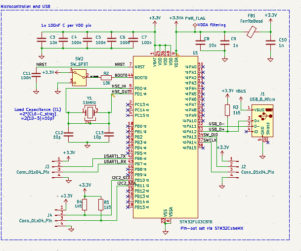
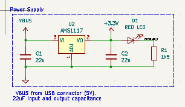
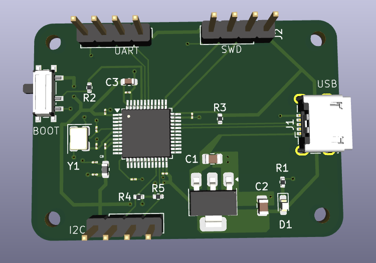
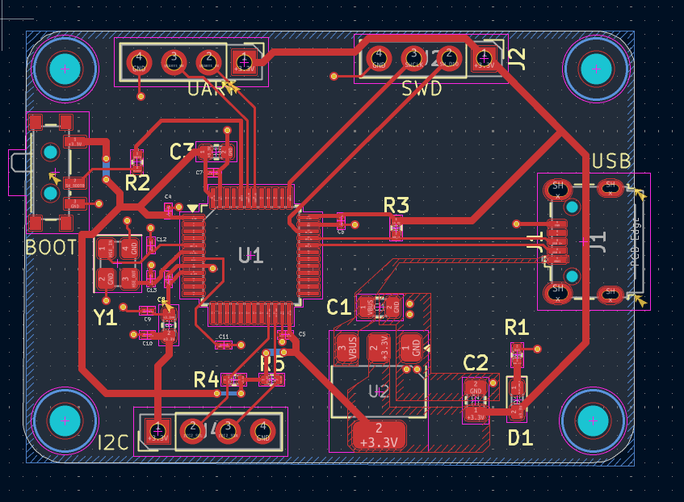

# stm32-PCB-design

PCB board for `STM32F103C8T6` Microcontroller, a micro usb power supply, a regulator to power the mcu to 3.3V, and a crystal oscillator for the mcu. It has a reset switch to boot the board, a UART interface UART (Universal Asynchronous Receiver-Transmitter) to  uses two wires to exchange serial data between devices without a shared clock, as well as Serial Wire Debug (SWD) which is a  hardware interface designed by ARM for programming and debugging ARM-based microcontrollers using a st-link programmer. 

## Schematic
**Microcontroller and USB**

**Power Supply**

## Board

**3D view**

**layout**

## Manufacturing

Manufacturing gerber files, drill files, and Bill of Materials (BOM) are located in the `Manufacturing` folder.
